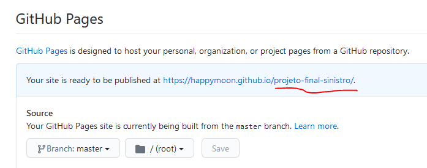

# Publicando no Github Pages

## Introdução

Antes de publicar a sua página no **Github Pages** certifique-se que você tenha uma conta no Github. Se não tiver, [crie uma conta](https://github.com/join).

O WoMakersCode oferece um material gratuito sobre Github caso queira saber mais sobre o assunto: [https://github.com/WoMakersCode/git-e-github](https://github.com/WoMakersCode/git-e-github) 

## Crie um repositório para seu projeto


Caso já tenha criado seu repositório, é só pular este passo e ir para o próximo

1. Na página inicial do seu **Github**, no canto superior direito clique no botão "**New**" para criar um novo **repositório** e dê um nome a ele (lembre-se deste nome pois precisará dele mais a frente), mas não crie o arquivo *README.md* ainda;
2. Abra o terminal e encontre o caminho da pasta do seu projeto;

    ```bash
    cd sua-pasta
    ```

3. Execute o seguinte comando para criar um arquivo README.md contendo a palavra "teste":

    ```bash
    echo "# teste" >> README.md
    ```

4. Execute o seguinte comando para iniciar um repositório de git na pasta do seu projeto:

    ```bash
    git init
    ```

5. Execute o seguinte comando para adicionar na fila de commit o arquivo README.md:

    ```bash
    git add README.md
    ```

6. Execute o seguinte comando para fazer o primeiro commit do seu repositório:

    ```bash
    git commit -m "primeiro commit"
    ```

7. Execute o seguinte comando para sincronizar sua pasta local com o repositório que você criou no Github:

    ```bash
    git remote add origin https://github.com/{username}/projeto-final.git
    ```

    *Esse endereço completo do repositório você pode pegar no Github, na tela seguinte após a criação do mesmo.*

8. Execute o seguinte comando para fazer o **push** (envio) dos seus arquivos para o repositório

    ```bash
    git push -u origin master
    ```

9. Com os comandos acima você irá criar o repositório a partir da linha de comando, subindo os arquivos que você criou na sua pasta local.

Nota: onde está escrito **projeto-final.git**, é o nome que você deverá escolher para o repositório do seu projeto final, e pode ser outro, ok? Esta é apenas uma sugestão! 💝 **Este nome será utilizado na URL pública do seu site após a publicação no Github Pages**, portanto é importante usar um nome legal e apresentável, como seu nome e sobreme, por exemplo!

## Subindo no Github Pages


O **Github Pages** é uma ferramenta que o Github oferece para publicarmos os nossos projetos hospedados no Github de forma gratuita usando o domínio github.io. Por padrão a URL é o nosso `username.github.io/nome-do-repositório`.

**Para publicar o seu projeto por lá basta seguir esses seguintes passos:**

- Dentro do seu repositório vá em "Settings";
- Procure por "**Github Pages**";
- Em "Source" selecione a opção para puxar os arquivos da branch master;
- Depois de salvo o Github irá informar a url da sua página;
- Teste a URL e verifique se está tudo certo.

    

---
Mais informações na documentação original do Github: [https://help.github.com/en/articles/configuring-a-publishing-source-for-github-pages](https://help.github.com/en/articles/configuring-a-publishing-source-for-github-pages)

---

Feito com amor por [Aline Bezzoco](https://www.linkedin.com/in/bezzocoaline/) e revisado por [Luanda Pereira](https://www.linkedin.com/in/luandapereira/)

---